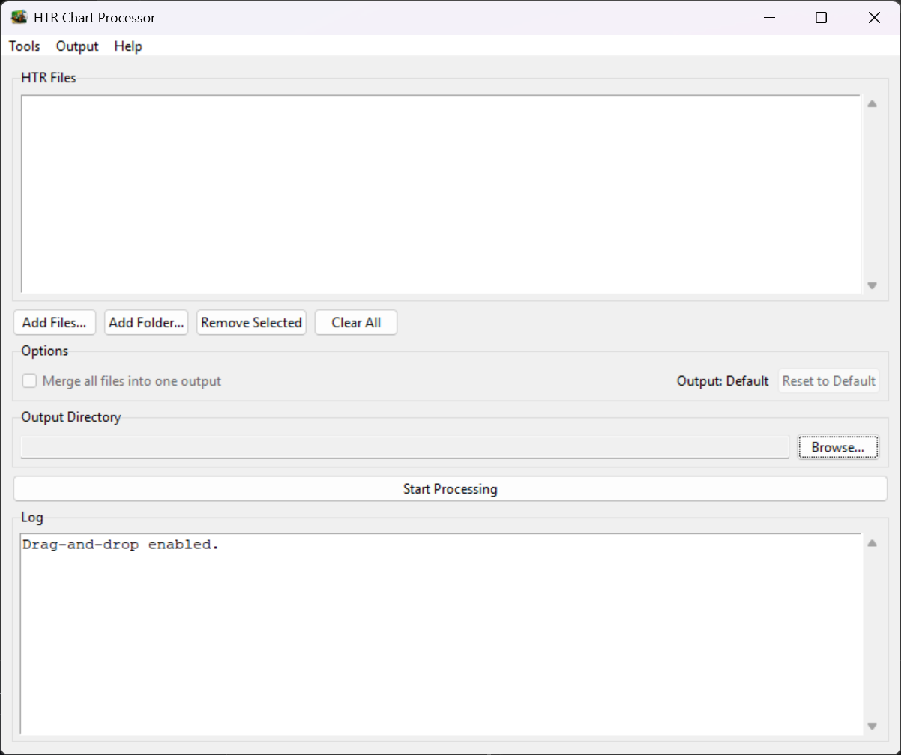
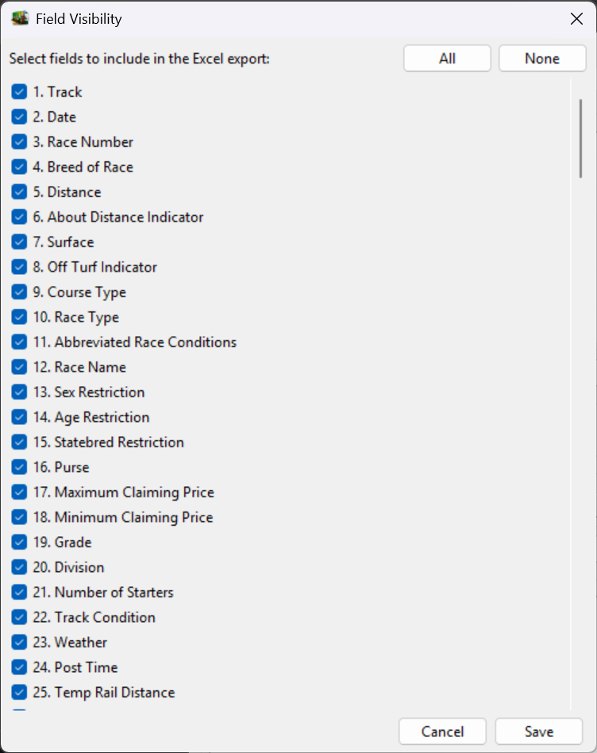
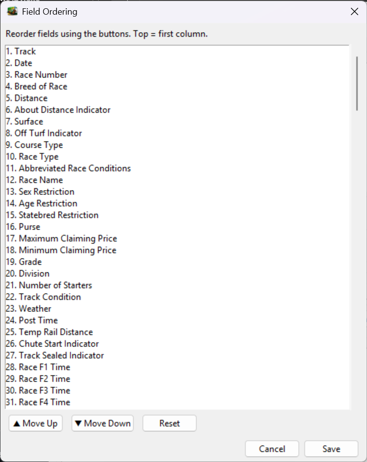

# HTR Race Charts Converter


**Development Team**
- **Lead Programmer:** Ken Torbeck ([ktorbeck@gmail.com](mailto:ktorbeck@gmail.com))
- **Researcher:** Dr. Russ Winterbotham from The Horse Ranker Project

**License:** [GPL-3.0](LICENSE)

---

**Disclaimer:** This project is not affiliated with HTR (Handicapping Technology & Research) or its developers. It is an independent, community-developed tool for processing HTR race chart exports.

---

## Platform Support (Option A)

- **Supported/Tested:** **Windows 10/11 only**.
- **Why:** HTR is Windows-only, so this project is now focused on Windows-only support.
- **Linux/macOS:** Not supported or tested. The code may run in some environments, but Linux/macOS are considered unsupported.

**Coming soon (Windows):**
- `setup.bat` for one-step environment setup
- `run.bat` for one-step app launch
- Optional prebuilt Windows `.exe` distribution

_Repository metadata note: add the `windows` GitHub topic in repo settings._

---

## Overview

HTR Race Charts Converter is a desktop application that transforms raw horse racing data files exported from **HTR (Handicapping Technology & Research)** into clean, formatted Excel workbooks and CSV files.

HTR exports race chart data as flat CSV text files with 244 coded fields per row and no column headers. Reading or analyzing these files directly is impractical. This program solves that problem by:

- Adding meaningful column headers to every field.
- Translating coded values (track surface, race type, age restrictions, etc.) into human-readable labels.
- Packaging the results into a professionally formatted Excel workbook with supporting reference sheets.

It is built for **handicappers, researchers, and data analysts** who work with HTR race chart exports and need structured, ready-to-use data.

---

## Features

- **Graphical interface** — select files, configure output, and run with a few clicks.
- **Drag-and-drop support** — drop HTR files or entire folders directly onto the window.
- **Batch processing** — process multiple race chart files at once.
- **Merge option** — combine multiple files into a single unified output, or export them individually. The merge checkbox is enabled automatically when two or more files are loaded.
- **Automatic lookup translation** — coded values are replaced with descriptive labels (e.g., race type codes become "Maiden Special Weight", "Claiming", etc.).
- **Formatted Excel output** — each workbook contains three sheets with Excel tables, auto-sized columns, and frozen headers.
- **CSV output** — a plain CSV file is also generated alongside each Excel workbook.
- **Reference sheets included** — Points of Call by Distance and Fractional Times by Distance are embedded in every workbook for quick lookup.
- **Configurable formatting** — table styles, borders, column sizing, and header freeze can be customized per sheet via `config.ini`.
- **Style validation** — invalid Excel table style names in the config are automatically detected and flagged.
- **Config rebuild** — a built-in menu option restores `config.ini` to factory defaults if it becomes corrupted or misconfigured.
- **Output path memory** — the program remembers your last output folder between sessions.
- **Auto-fill output directory** — when files are added and no output directory has been selected yet, the output directory is automatically set to the folder of the first input file.
- **Background processing** — file processing runs in a background thread so the GUI stays responsive.
- **About dialog** — version number, team credits, license, and project link are available under **Help → About**.

---

## Project Structure

```text
project_root/
│
├── assets/
│   ├── icons/
│       ├── apps/                ← application icons (32–512 px, for taskbar and About dialog)
│       │   ├── htr_racecharts_converter_32.png
│       │   ├── htr_racecharts_converter_64.png
│       │   ├── htr_racecharts_converter_128.png
│       │   ├── htr_racecharts_converter_256.png
│       │   ├── htr_racecharts_converter_512.png
│       │   ├── schema_editor_32.png
│       │   ├── schema_editor_64.png
│       │   ├── schema_editor_128.png
│       │   ├── schema_editor_256.png
│       │   └── schema_editor_512.png
│       └── master/              ← high-resolution masters (1024–4096 px, for README and About dialogs)
│           ├── htr_racecharts_converter_1024.png
│           ├── htr_racecharts_converter_2048.png
│           ├── htr_racecharts_converter_4096.png
│           ├── schema_editor_1024.png
│           ├── schema_editor_2048.png
│           └── schema_editor_4096.png
│   └── screenshots/             ← README screenshot placeholders (add images here)
│
├── src/
│   ├── main.py              ← entry point; launches the GUI
│   ├── gui.py               ← main application window and all UI logic
│   ├── processor.py         ← orchestrates the full processing pipeline
│   ├── schema_loader.py     ← loads scheme files (fields.json, lookup.json, CSVs)
│   ├── translator.py        ← applies lookup translations and builds headers
│   ├── validator.py         ← validates field counts, lookup codes, and distances
│   ├── exporter.py          ← exports CSV and Excel workbooks
│   ├── version.py           ← single-source version number
│   └── utils/
│       ├── csv_utils.py     ← HTR file parsing
│       ├── excel_utils.py   ← Excel table and formatting helpers
│       ├── file_utils.py    ← file collection and extension validation
│       ├── formatting_utils.py ← column sizing and border helpers
│       └── ini_utils.py     ← config.ini reading/writing
│
├── scheme/
│   ├── fields.json          ← field names, types, and metadata (244 fields)
│   ├── lookup.json          ← lookup translation tables
│   ├── points_of_call.csv   ← point-of-call labels by race distance
│   └── race_fractional_times.csv ← fractional time labels by race distance
│
├── tools/
│   ├── __init__.py
│   ├── __main__.py          ← allows `python -m tools`
│   └── schema_editor.py     ← developer tool for editing scheme files (see below)
│
├── tests/                   ← unit tests (Python unittest)
│
├── config.example.ini       ← template for config.ini
├── requirements.txt
└── FeatureRequirements.txt
```

---

## Requirements

| Requirement | Details |
|---|---|
| **Python** | 3.10 or higher |
| **openpyxl** | Excel workbook generation |
| **tkinter** | Required for the GUI (keep Tk support enabled during Windows Python installation). |
| **tkinterdnd2** | Optional drag-and-drop support. If not installed, the app still works using **Add Files...** and **Add Folder...**. |

---

## Installation

### Windows

1. Install Python 3.10+ from [python.org](https://www.python.org/downloads/windows/).  
   During setup, enable **"Add Python to PATH"** and keep **tkinter** support enabled.

2. Open **Command Prompt** or **PowerShell** in the project folder, then create and activate a virtual environment:

   ```powershell
   py -3 -m venv .venv
   .venv\Scripts\activate
   ```

3. Install dependencies:

   ```powershell
   python -m pip install -r requirements.txt
   ```

4. Run the app:

   ```powershell
   python src/main.py
   ```

> **Coming soon:** streamlined Windows launch scripts (`setup.bat`, `run.bat`) and an optional Windows `.exe`.

---

## GUI Guide

### 1) Launch the app

Run:

```bash
python src/main.py
```

The **HTR Chart Processor** window opens.

### 2) Add input files

You can load HTR `.TXT` files using:

- **Add Files...** (pick one or more files)
- **Add Folder...** (loads all `.TXT` files in that folder)
- **Drag and drop** files/folders into the app window (if `tkinterdnd2` is installed)

Use **Remove Selected** or **Clear All** to manage the file list.

### 3) Choose output directory

- Click **Browse...** in **Output Directory**.
- The app remembers your last used output folder in `config.ini` (`[paths] last_output`).
- If no output directory is set yet, the app auto-fills it to the folder of the first input file you add.

### 4) Merge behavior

- **Merge all files into one output** is only enabled when 2+ files are loaded.
- With merge on, all loaded files are combined into one output.
- With merge off, each input file is exported separately.

### 5) Start Processing + Log panel

- Click **Start Processing** to run conversion.
- Processing runs in a background thread so the GUI stays responsive.
- Progress and errors are written to the **Log** panel.

### 6) Menus and output customization controls

- **Tools → Rebuild config.ini**: reset configuration to defaults (preserves last output path).
- **Output → Field Visibility...**: choose which fields appear in customized output.
- **Output → Field Ordering...**: reorder fields for customized output.
- **Reset to Default** button (Options area): reset output customization to default behavior.

The indicator in the Options area shows current status:
- **Output: Default**
- **Output: Customized**

### 7) Screenshots

**Figure 1. Main Window**


**Figure 2. Field Visibility Dialog**


**Figure 3. Field Ordering Dialog**



### About

Go to **Help → About** to view version, credits, license, and repository link.

---

## Configuration (config.ini)

Most users should use the GUI for day-to-day settings:

- **Output directory** (Browse button)
- **Field Visibility** dialog
- **Field Ordering** dialog
- **Reset to Default** for output customization

Use direct `config.ini` editing mainly for advanced/manual settings (especially Excel formatting options not exposed in the GUI).

> **Important:** `config.ini` is not included in the repository (`.gitignore`). Copy `config.example.ini` to `config.ini` before manual editing. If `config.ini` does not exist at startup, the app can create one with defaults.

### GUI-driven vs manual-only settings

| Section / Key | Preferred method | Notes |
|---|---|---|
| `[paths] last_output` | GUI | Set by **Output Directory → Browse...** and saved after successful processing. |
| `[output] visible_fields` | GUI | Managed by **Output → Field Visibility...** |
| `[output] custom_order` | GUI | Managed by **Output → Field Ordering...** |
| `[race_data]`, `[points_call]`, `[fractional_times]` formatting keys | Manual `config.ini` edit | Not exposed in GUI. Keep these as advanced settings. |

### Manual-only Excel formatting settings (not in GUI)

These remain manual `config.ini` options:

| Key | Values | Description |
|---|---|---|
| `table_style` | Any valid Excel table style name | The visual style applied to the data table. Examples: `TableStyleLight1` through `TableStyleLight21`, `TableStyleMedium1` through `TableStyleMedium28`, `TableStyleDark1` through `TableStyleDark11`. |
| `borders` | `yes` / `no` | Whether thin borders are drawn around every cell. |
| `auto_size_columns` | `yes` / `no` | Whether column widths are automatically adjusted to fit content. |
| `freeze_header` | `yes` / `no` | Whether the header row stays visible when scrolling down. |

### Paths section

| Key | Values | Description |
|---|---|---|
| `last_output` | `Default` or a folder path | The output directory used for the next export. When set to `Default`, output files are saved to the same folder as the input file. After you choose a different output directory, this value is automatically updated to that path. |

### Customized Output (Field Visibility & Field Ordering)

Customized output settings are stored in `config.ini` under `[output]`:

| Key | Default | Meaning |
|---|---|---|
| `visible_fields` | `all` | Which fields are included |
| `custom_order` | `default` | Column order |

- Custom values for both keys are comma-separated field numbers using 1-based indexing, for example: `1,2,3,10`.
- Field numbers map to the canonical schema order in `scheme/fields.json` (also shown in the Field Visibility/Field Ordering dialogs).
- High-level algorithm:
  1. Build the order from `custom_order` (or canonical default order when `default`).
  2. Build the visible set from `visible_fields` (or all fields when `all`).
  3. Final output fields = ordered list intersected with visible set.

#### Output files when customized

- Base output name gets a `_customized` suffix.
  - Example: `SA0322F_customized.xlsx`, `SA0322F_customized.csv`
- A companion text file is generated:
  - `*_customized.txt`
  - Lists each chosen field with:
    - output position
    - field name
    - original field number

#### Scope

- Customized visibility/order is applied to **all output formats**: Excel (`.xlsx`), CSV (`.csv`), and the companion field list (`.txt`).

### Default Configuration

```ini
[race_data]
table_style = TableStyleMedium9
borders = yes
auto_size_columns = yes
freeze_header = yes

[points_call]
table_style = TableStyleMedium11
borders = no
auto_size_columns = yes
freeze_header = yes

[fractional_times]
table_style = TableStyleMedium12
borders = no
auto_size_columns = yes
freeze_header = yes

[paths]
last_output = Default

[output]
visible_fields = all
custom_order = default
```

### Invalid Style Names

If you enter a table style name that Excel does not recognize, the program will:

1. Mark the value in the INI as `INVALID - <your value>` so you can see what went wrong.
2. Use the default style for that sheet instead.

### Rebuilding the Config

If `config.ini` becomes corrupted or you want to start fresh, go to **Tools → Rebuild config.ini** in the menu bar. This resets Excel formatting and output customization settings to defaults while preserving your last output directory.

---

## Input Files

The program accepts `.TXT` files exported from HTR's Race Chart data product.

- Each file is a CSV (comma-separated) text file.
- Each row represents one race starter and contains exactly **244 fields**.
- Files contain **no headers** — the program adds them automatically from its built-in schema.
- File names typically follow HTR's naming convention (e.g., `SA0322F.TXT`, `TP0312F.TXT`), but any `.TXT` file in the correct format will work.

---

## Output Files

For each input file (or merged group), the program produces:

- A CSV file (`.csv`)
- An Excel workbook (`.xlsx`)
- If output customization is active, a companion field list text file (`*_customized.txt`)

### CSV File (`.csv`)

A plain comma-separated file with a header row and all lookup codes translated to readable labels. This file can be opened in any spreadsheet application or imported into databases and analysis tools.

### Excel Workbook (`.xlsx`)

A formatted workbook containing three sheets:

| Sheet | Contents |
|---|---|
| **Processed Race Data** | The main output — all 244 fields with headers and translated lookup values. Each row is one race starter. |
| **Points of Call by Distance** | A reference table showing the names of the five points of call (e.g., "Start", "1/4 mile", "Stretch", "Finish") for each race distance. Use this to interpret the points-of-call fields in the race data. |
| **Fractional Times by Distance** | A reference table showing the names of the five fractional time splits (e.g., "2 furlongs", "4 furlongs", "6 furlongs", "Final") for each race distance. Use this to interpret the fractional time fields in the race data. |

Each sheet is formatted as an Excel Table with configurable styles, optional borders, auto-sized columns, and a frozen header row.

---

## Developer Tools

### Schema Editor (`tools/schema_editor.py`)

> **Note:** This tool is intended for developers who need to maintain or extend the scheme files (`scheme/fields.json` and `scheme/lookup.json`). It is **not** a general-use tool and is not required to run or use the main application.

The Schema Editor is a standalone Tkinter GUI that allows developers to view and edit the scheme files that drive the main application. It reuses the same loading and validation logic as the main program to ensure consistency.

**Capabilities:**
- Browse all 244 field definitions (field number, name, type, maxLength, comments, hasOptions, lookupRef)
- Edit field properties through a form interface
- Validate the scheme for missing keys, unknown types, and broken lookup references
- Save changes back to `scheme/fields.json`

**Limitations:**
- Editing `scheme/lookup.json` directly is not supported in this version (it is loaded for reference/validation only).
- Not intended for end users — incorrect changes to the scheme files will break processing.

**How to run** (from the project root):

```
python -m tools
```

or

```
python tools/schema_editor.py
```

Requires `tkinter` (included with standard Python installations) and the `scheme/` directory to be present.

---

## Troubleshooting

### Linux/macOS status

Linux and macOS are **not supported or tested** for this project. The application may run in some non-Windows environments, but those platforms are outside supported scope.

### General

| Problem | Solution |
|---|---|
| **"Drag-and-drop unavailable"** in the log | Install the `tkinterdnd2` library: `pip install tkinterdnd2`. The program still works without it — use the Add Files or Add Folder buttons instead. |
| **Permission denied** error when saving output | The output file may be open in another program (e.g., Excel). Close the file and try again. |
| **"No .TXT files found"** after adding a folder | Make sure the folder contains `.TXT` files directly (not nested in subfolders). |
| **Validation error about field count** | The input file may not be a valid HTR race chart export. Each row must contain exactly 244 fields. |
| **Lookup code error** | The input file contains a coded value that is not in the program's lookup tables. This may indicate a newer HTR data format. Contact the development team. |
| **config.ini issues** | Use **Tools → Rebuild config.ini** to restore default settings. |
| **"INVALID - …" appears in config.ini** | You entered a table style name that Excel does not recognize. Check the spelling and use a valid style such as `TableStyleMedium9`. Rebuild the config to reset all styles. |

---

## Versioning / Updates

This program is under active development. Features, configuration options, and supported data formats may change over time. Please check this README for updated instructions after receiving a new version.

---

## Credits / License

**HTR Race Charts Converter**
Developed by Ken Torbeck and Dr. Russ Winterbotham.

HTR (Handicapping Technology & Research) is a product of Ken Massa.

This project is licensed under the **GNU General Public License v3.0**. See the [LICENSE](LICENSE) file for full details.

You are free to use, modify, and distribute this software under the terms of the GPL-3.0 license.
